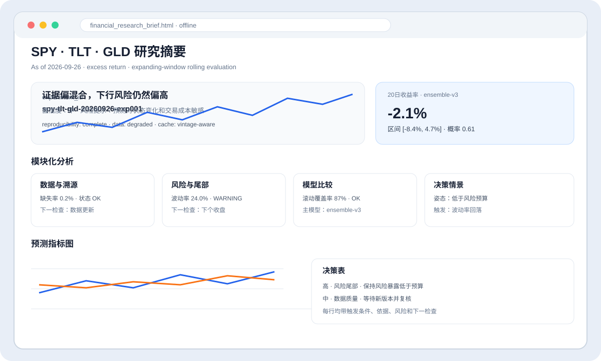
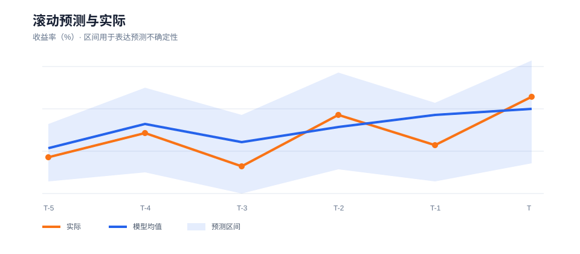
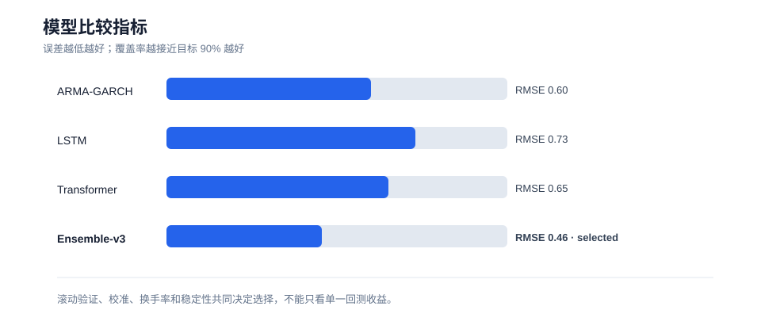
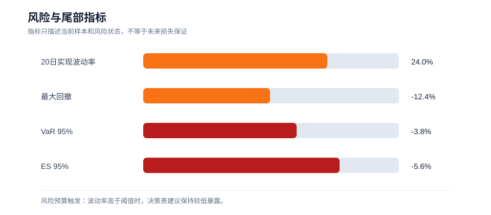
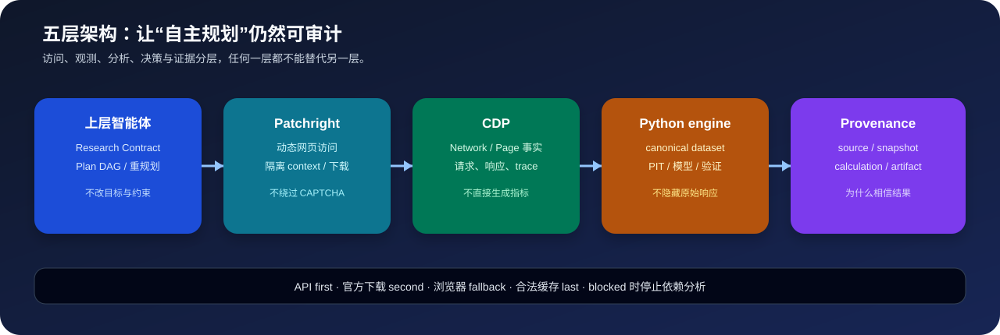
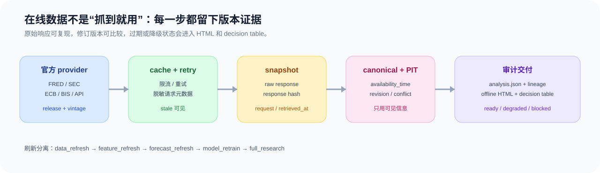
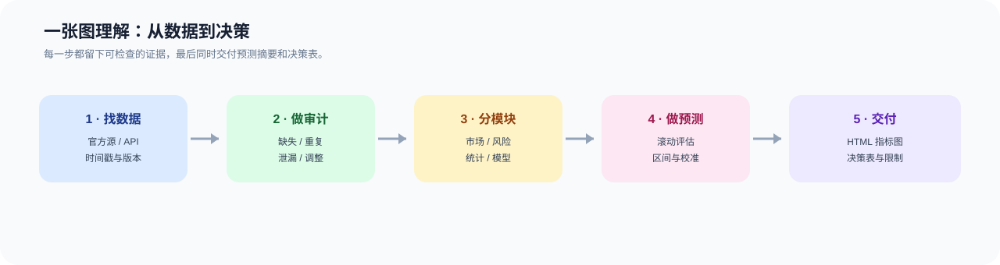
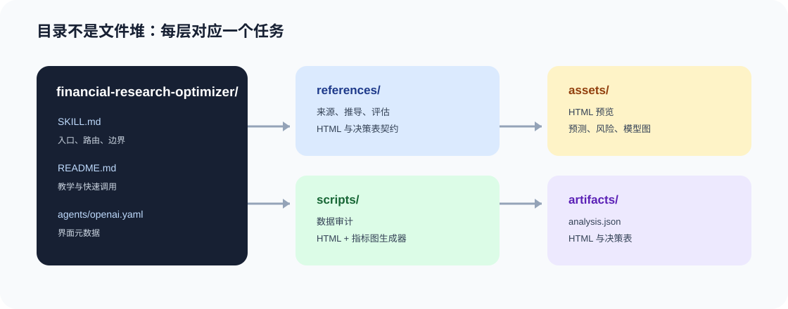
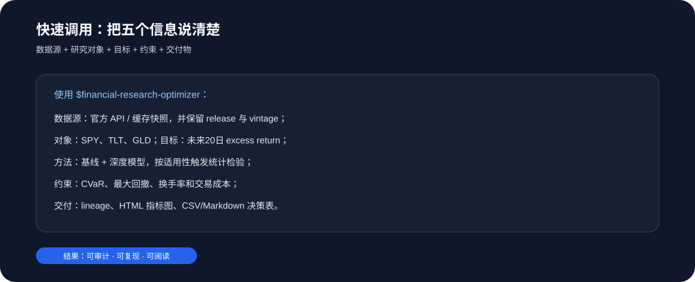

# Financial Research Optimizer

一个由上层智能体驱动、可审计的 Python 金融研究执行引擎。它把 Patchright 浏览器访问、CDP 事实观测、Python 标准化/分析、Plan DAG 规划和 provenance 证据链组合起来；读取金融数据后，按模块分析、形成条件预测，并强制生成精炼的离线 HTML 摘要和决策表。

它按 `minimal`、`standard`、`research_grade`、`portfolio_grade` 四个输出等级运行；每次运行先通过 `run_preflight.py`，再进入数据、模型、回测和组合阶段。

## 适用场景

- 搜索公开股票、指数、基金、期货、利率、汇率、商品或宏观数据；
- 分析市场状态、资讯主题、波动率和风险暴露；
- 比较 OLS、岭回归、ARMA/GARCH、LSTM、CNN、Transformer、贝叶斯模型和图模型；
- 进行滚动预测、概率校准、压力测试和多轮模型比较；
- 在交易成本、换手率、流动性、杠杆和风险预算约束下做组合优化。
- 当数据位于关系数据库时，通过 Java/MyBatis 做只读、按时间窗口、可溯源的数据读取，再交给统计和深度学习模型。
- 将数据质量、市场状态、统计结构、风险尾部、预测比较和决策情景分模块呈现；每个模块同时给出事实、解释、预测、置信度和下一次检查项。
- 生成单文件、无外部依赖的 HTML 可视化摘要，以及 CSV/Markdown 决策表。
- 对多模型回测执行 DM、White Reality Check、SPA、DSR 和 PBO 审计；对样本、Ledoit-Wolf、因子和稳健协方差进行扰动比较，并记录可复现实验 Manifest。
- 通过 FRED/ALFRED、SEC EDGAR、ECB SDMX、BIS SDMX 适配器保存原始响应、缓存、哈希和 revision/vintage 信息；API 优先，浏览器是受控 fallback。
- 通过 Plan DAG 让上层智能体选择下一步、有限重试和声明式降级，但不得修改研究目标、放宽约束或执行交易。

## 输出理念

Skill 把结果拆成四层：

1. 数据事实：来源、时间、字段和质量；
2. 统计/深度模型：条件分布、预测和不确定性；
3. 决策层：组合目标、约束、成本和优化结果；
4. 审计层：滚动验证、稳定性、压力测试和失败边界。

每次运行还必须登记 `experiment_id`、数据快照哈希、代码/环境版本、随机种子、模型参数、特征版本、训练/评估窗口和输出文件。多源数据先经过 `source_reconciliation`；如果出现未解决的实质冲突，HTML 和决策表必须显示阻断状态，不能继续给出依赖该数据的结论。

“最佳模型”只表示在预先声明的样本外指标和风险约束下表现最好的候选，不表示保证未来收益。Skill 不会自动下单。

## 可视化预览

生成的 HTML 是一个精炼的研究摘要：顶部给出结论、预测值、区间和置信度；中部按模块呈现数据、风险与模型证据；底部给出决策表和复现信息。



HTML 会把预测后的指标直接绘制成内嵌 SVG 图，包括实际值与模型均值、预测区间、风险指标和模型比较结果。这样打开单个 HTML 文件即可查看，不依赖 CDN 或外部前端服务。







## 分层流程

agent contract -> plan DAG -> preflight -> source routing -> API/cache/browser/CDP capture -> raw snapshot -> canonical transformation -> reconciliation -> point-in-time audit -> feature/label contract -> baselines -> challengers -> rolling validation -> applicable diagnostics -> calibration -> covariance robustness -> portfolio optimization -> monitoring -> selection -> provenance manifest -> HTML + decision table

每个阶段都要保存可检查的中间结果，避免只输出一个无法追溯的预测数字。任何完成的数据分析都必须至少产出：`analysis.json`、精炼 HTML、决策表和数据/模型审计记录。

可执行模式：

| 模式 | 最低交付物 |
|---|---|
| `data_audit` | 数据字典、质量报告、来源清单 |
| `descriptive_analysis` | 市场状态、风险指标、图表 |
| `forecasting` | 基线、滚动预测、区间、校准 |
| `backtest` | 成本、换手、风险、适用的过拟合诊断 |
| `portfolio_research` | 权重、约束、协方差稳健性、压力测试和归因 |

只有 `backtest` 和 `portfolio_research` 强制进入完整适用性审计；`not_applicable` 不被当作失败。

## 五层执行架构

| 层 | 职责 | 不负责的事情 |
|---|---|---|
| 上层智能体 | 解析任务、生成 Research Contract、选择 Plan DAG 节点和声明式 fallback | 不直接操作浏览器对象，不改目标/成本/风险约束 |
| Patchright | 动态网页、隔离 context、授权态、下载、截图和 trace | 不做模型计算、数据可信判断、交易或访问控制绕过 |
| CDP | Network/Page/Runtime/Target/Storage/Fetch/Performance/Tracing 的事实观测 | 不把页面显示值直接变成 canonical 数据 |
| Python engine | API/cache/snapshot、标准化、PIT 审计、特征、模型、验证和输出 | 不隐藏原始响应或跳过 provenance |
| Provenance | source/snapshot/calculation/input/code/artifact 的可追溯证据链 | 不替模型或智能体做未声明的决策 |



这五层分别回答“下一步做什么”“如何访问网页”“浏览器实际发生了什么”“如何标准化、分析和验证”以及“为什么相信这个结果”。

结果 lineage 是 HTML 门禁：任何进入图表、审计区块或决策产物的数值都必须拥有 `source_ids`、`calculation_id`、`input_hash`、`code_version` 和 `formula`。运行：

```bash
python3 scripts/verify_result_lineage.py examples/demo_analysis.json
```

## 在线数据与降级

在线连接器位于 `scripts/online/`：

- `fred_alfred.py`：series、release 和 real-time/vintage 参数；
- `sec_edgar.py`：submissions 与 XBRL Company Facts；
- `ecb_sdmx.py`、`bis_sdmx.py`：SDMX flow/key 查询；
- `http_cache.py`、`retry_policy.py`、`snapshot_store.py`：缓存、重试、原始响应和快照 Manifest；
- `provider_registry.py`：API → 官方下载/浏览器 → 合法缓存的路由策略。



刷新被拆为 `data_refresh`、`feature_refresh`、`forecast_refresh`、`model_retrain` 和 `full_research`。新数据不会自动触发重训；只有预定周期或漂移阈值满足时才进入重训流程：

```bash
python3 scripts/run_online_refresh.py --config examples/research_config.json --output artifacts/refresh_plan.json
python3 scripts/check_data_freshness.py artifacts/snapshots/provider/snapshot.json --output artifacts/freshness.json
python3 scripts/monitoring/model_monitor.py artifacts/monitor_input.json --output artifacts/monitoring_status.json
```

动态 preflight 状态为 `ready`、`stale`、`degraded`、`fallback` 或 `blocked`。只有 `blocked` 禁止继续依赖分析；其余状态必须在 HTML 中显示数据延迟、缓存、模型和预测有效期。

## 金融网站 Source Adapter Registry

`config/source_registry.yaml` 把国家数据、人民银行、巨潮、上交所、深交所、东方财富、同花顺、Wind、CSMAR、SEC EDGAR、FRED/ALFRED、Nasdaq Data Link、Yahoo Finance、Investing.com、TradingView、AkShare、Tushare 和 JoinQuant 定义成可路由的 source profile。上层智能体按权威性、Point-in-Time 能力、字段完整度、新鲜度、授权状态和稳定性选择来源，而不是只判断网页能否打开：

```bash
python3 scripts/validate_source_registry.py
python3 scripts/source_router.py \
  --topic "美国 CPI 历史修订值" \
  --universe CPIAUCSL \
  --capability point_in_time \
  --capability vintage_data
```

适配链路固定为：`官方 API → 官方下载 → 已授权数据库 → Patchright → CDP → DOM → 合法缓存`。原始响应先通过 `scripts/source_snapshot.py` 保存哈希和请求元数据，再由 `scripts/normalize_observations.py` 转成 `schemas/canonical_observation.schema.json`；未经 canonicalization 的记录不能进入模型。Wind、CSMAR、Nasdaq Data Link 和 JoinQuant 只接受授权 API、数据库、CSV/Excel 或快照导入，不进行未授权爬取。

## 标准呈现

默认按以下结构输出：

- 研究合同；
- 数据来源与质量审计；
- 内容/市场状态摘要；
- 特征和标签公式；
- 模型卡和假设；
- 滚动预测与校准；
- 组合目标与约束；
- 多轮比较和选择规则；
- 情景分析；
- 局限性与复现信息。



阅读顺序是：先确认数据事实，再看统计与深度模型，最后阅读情景预测和决策表。图表只展示已有的计算结果，不替代滚动评估、数学推导或数据溯源。

## HTML 与决策表

结构化分析完成后先运行 preflight，再生成 HTML：

```bash
python3 scripts/run_preflight.py \
  --config examples/research_config.json \
  --manifest examples/experiment_manifest.json \
  --analysis examples/demo_analysis.json \
  --output artifacts/preflight.json
python3 scripts/generate_financial_html.py examples/demo_analysis.json \
  --config examples/research_config.json \
  --manifest examples/experiment_manifest.json \
  --output-dir artifacts --decision-format both
```

HTML 默认包含：标题与 as-of 时间、核心结论、目标/概率/区间、模块状态卡、预测与风险指标图、模型卡、反过拟合审计、数据源冲突审计、组合稳健性、情景预测、风险提示和决策表。页首和决策层展示 `experiment_id` 与 `reproducibility_status`；它内嵌 CSS/SVG，可离线打开，不依赖 CDN，不展示没有来源或不确定性说明的数字；完成的预测运行不得省略指标图。

推荐显式绑定同一份研究配置和实验 Manifest：

```bash
python3 scripts/validate_research_config.py examples/research_config.json
python3 scripts/validate_experiment_manifest.py examples/experiment_manifest.json
python3 scripts/validate_schemas.py
python3 scripts/generate_financial_html.py examples/demo_analysis.json \
  --config examples/research_config.json \
  --manifest examples/experiment_manifest.json \
  --output-dir artifacts --decision-format both
```

示例文件：[`examples/financial_research_brief.html`](examples/financial_research_brief.html)。

决策表至少包含：优先级、模块、当前判断、建议动作/仓位姿态、触发条件、依据、风险、有效期、下一次检查、实验 ID、复现状态；在线运行还附带 `source_id`、访问方式、freshness、snapshot hash、revision、授权和 Point-in-Time 状态，以及数据/缓存/模型/预测状态。表中的“动作”是研究与决策支持表达，不是自动下单指令。

## 目录



- SKILL.md：主说明和路由规则；
- references/content_contract.md：内容呈现契约；
- references/workflow_blueprint.md：流程状态机和多轮选择规则；
- references/model_derivations.md：模型数学推导摘要；
- references/java_data_layer.md：Java/MyBatis 数据接入、时间序列 SQL、类型映射与溯源规范；
- references/data_provenance.md：公开数据来源与溯源规范；
- references/rolling_evaluation.md：滚动评估与组合优化规范；
- references/preflight_contract.md：输出等级、启动门禁和阻断规则；
- references/feature_label_contract.md：可用时间、lineage、purge、embargo 和标签重叠规则；
- references/model_selection_protocol.md：五维模型选择协议；
- references/backtest_overfitting.md：多重回测和模型试验的反过拟合检验；
- references/point_in_time_data.md：发布日期、可用时间、版本和生存者偏差规则；
- references/source_reconciliation.md：多数据源字段冲突、容差、优先级和阻断规则；
- references/portfolio_robustness.md：四类协方差与组合扰动分析；
- references/model_registry.md：模型卡和版本登记规范；
- references/experiment_manifest.md：实验运行账本和复现状态规范；
- references/html_output_contract.md：结构化分析 JSON、HTML 和决策表契约；
- references/result_lineage.md：结果数值、计算、输入快照和来源血缘契约；
- references/online_data_contract.md、references/patchright_cdp_contract.md：在线 provider、缓存、快照、浏览器和 CDP 观测契约；
- references/source_adapter_contract.md、references/browser_adapter_contract.md：金融网站 source profile、访问优先级和浏览器适配器契约；
- references/source_priority_rules.md、references/licensed_data_policy.md：来源权威性、冲突阻断和授权数据政策；
- references/agent_execution_contract.md：Research Contract、Plan DAG、预算、重试和降级规则；
- references/event_data_contract.md、references/transformation_contract.md：事件时间和网页/API 到 canonical dataset 的转换规则；
- references/browser_security.md：授权 context、cookie、token、trace 和只读边界；
- references/online_monitoring.md：数据新鲜度、漂移、校准、成本和 fallback 监控；
- references/asset_class_contracts/：equity、ETF、futures、fixed income、FX、options、crypto 契约；
- experiment_manifest.schema.json：实验可复现性 Manifest JSON Schema；
- analysis.schema.json、result_lineage.schema.json、online_snapshot.schema.json、monitoring_status.schema.json、refresh_policy.schema.json、event_data.schema.json、canonical_record.schema.json、network_capture.schema.json：分析、结果血缘、在线状态、规范化记录和 CDP 网络 Schema；
- schemas/source_profile.schema.json、schemas/source_snapshot.schema.json、schemas/canonical_observation.schema.json：来源注册、原始快照和 canonical observation Schema；
- agent_contracts/：task、plan、node result 和 artifact Schema；
- config/source_registry.yaml：可执行金融网站 Source Adapter Registry；
- backtest_overfitting.schema.json、model_selection.schema.json、portfolio_output.schema.json、preflight.schema.json、feature_label_contract.schema.json、feature_label_audit.schema.json、source_reconciliation.schema.json：研究、特征、组合和来源契约 Schema；
- pyproject.toml：依赖、pytest 配置和命令入口；
- scripts/config_utils.py、scripts/manifest_utils.py：统一配置/Manifest 读取与指纹；
- scripts/validate_financial_dataset.py：CSV 数据质量审计脚本；
- scripts/reconcile_sources.py、scripts/point_in_time_audit.py：源冲突和未来信息审计；
- scripts/rolling_split.py、scripts/portfolio_robustness.py：滚动切分和组合稳健性工具；
- scripts/feature_label_audit.py、scripts/overfitting_applicability.py、scripts/run_preflight.py、scripts/validate_schemas.py：特征/标签审计、适用性触发、运行前门禁和离线 Schema 校验；
- scripts/verify_result_lineage.py：HTML/decision table 的结果可信度门禁；
- scripts/online/：FRED/ALFRED、SEC、ECB、BIS、provider registry、缓存、重试和 snapshot store；
- scripts/source_router.py、scripts/source_snapshot.py、scripts/normalize_observations.py：Source Adapter 路由、快照和标准化入口；
- scripts/adapters/：国家数据、人民银行、巨潮、交易所、聚合器、FRED/ALFRED、SEC、授权数据和库适配器；
- scripts/browser/：Patchright runtime、隔离 context、CDP network recorder、下载、页面快照和 trace；
- scripts/transform/、scripts/events/：HTML/JSON/PDF/canonical 转换与事件时间审计；
- scripts/agent/、scripts/monitoring/：Plan DAG、执行/重规划、安全策略、新鲜度和模型漂移监控；
- financial_research/：上层 agent 的统一 `run()` 接口；
- scripts/generate_financial_html.py：从结构化分析 JSON 生成离线 HTML 与决策表。
- tests/：最小 synthetic financial dataset 和 pytest 回归测试；
- .github/workflows/ci.yml：配置、Manifest、审计、HTML 和组合 fallback 的 CI。
- requirements.txt、requirements-dev.txt：运行与测试依赖；测试统一使用 `python3 -m pytest -q`；
- assets/：HTML 预览、预测指标、模型比较、风险、五层架构、在线 provenance、流程教学和目录说明图片；
- examples/：示例分析 JSON、在线 snapshot、生成的 HTML 和决策表。
- requirements-browser.txt：可选 Patchright 浏览器运行依赖；
- examples/java-mybatis/：只读 Mapper、Java 时间序列 DTO 和 XML 查询示例。

## 快速调用

$financial-research-optimizer

示例：

使用 $financial-research-optimizer 搜索公开数据，比较 ARMA-GARCH、LSTM 和 Transformer 对沪深300未来20个交易日波动率的预测，在最大回撤、换手率和交易成本约束下进行多轮模型选择。



快速调用时至少写清楚六件事：数据源、研究对象、预测目标、风险/成本约束、输出等级、交付物。Skill 会先执行 preflight，再生成模块总结、预测区间、指标图、HTML 和决策表。

上层 Python agent 也可使用统一接口；默认只生成计划并执行已注册 handler，不会直接启动浏览器或访问外网：

```python
import asyncio
from financial_research import run

result = asyncio.run(run(
    task="分析 SPY 未来 20 个交易日波动率",
    mode="forecasting",
    output_level="research_grade",
    universe=["SPY"],
    target="volatility",
    horizon="20d",
    constraints={"max_drawdown": 0.20, "transaction_cost_bps": 10},
))
```

浏览器访问必须显式安装 browser extra，并由 agent policy guard 检查 context 与权限；数据仍必须回到 Python canonicalization、PIT audit 和 provenance 流程。

## 免责声明

这是研究与决策支持工具，不是投资顾问、交易执行器或收益保证器。任何结论都必须结合数据更新时间、模型不确定性、市场制度变化和用户自己的风险承受能力。
