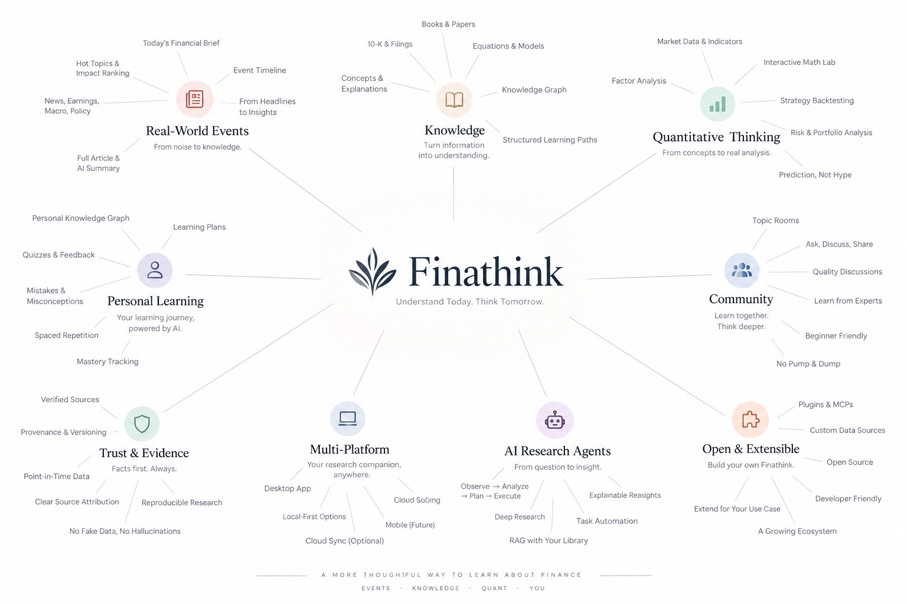
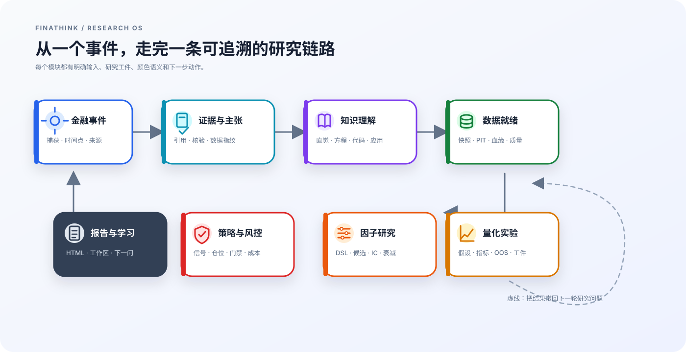
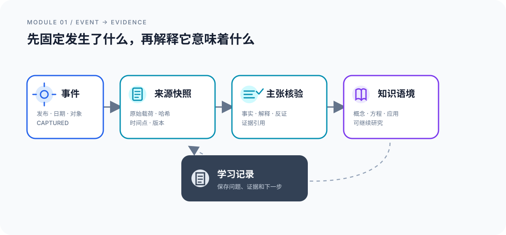
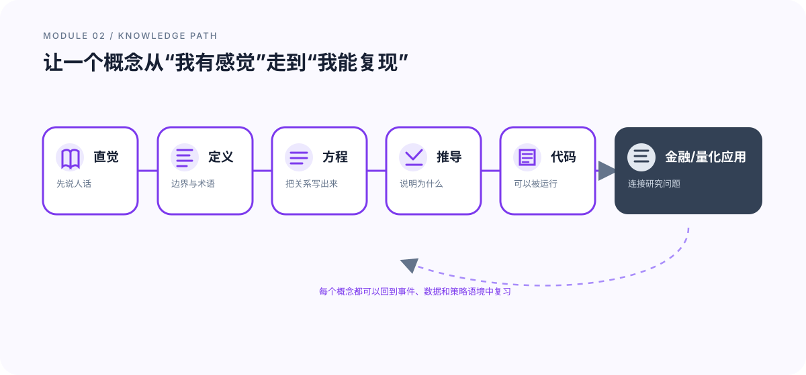
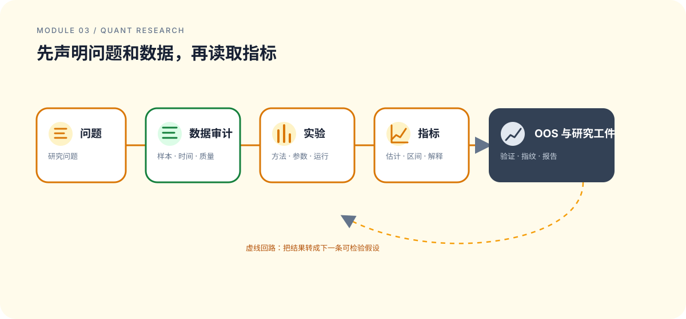
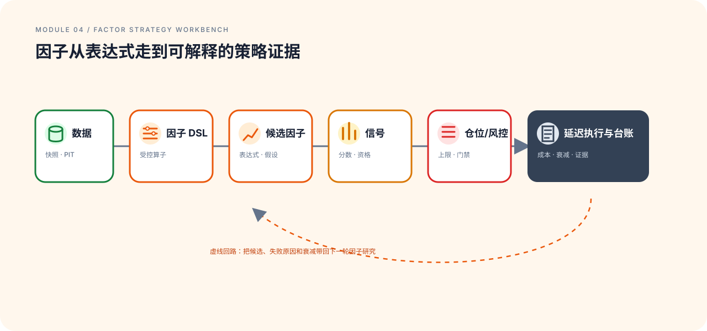
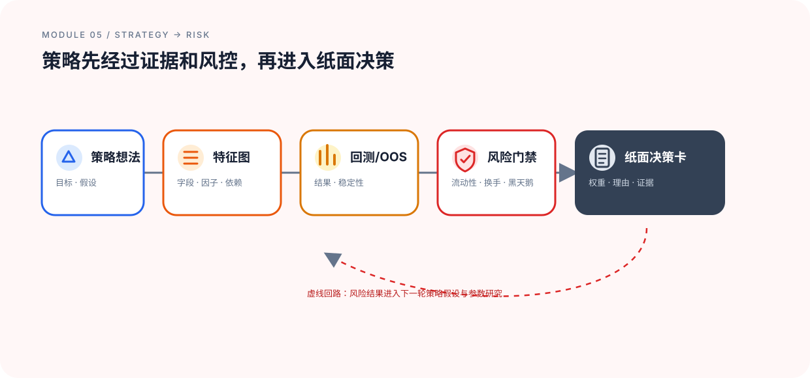
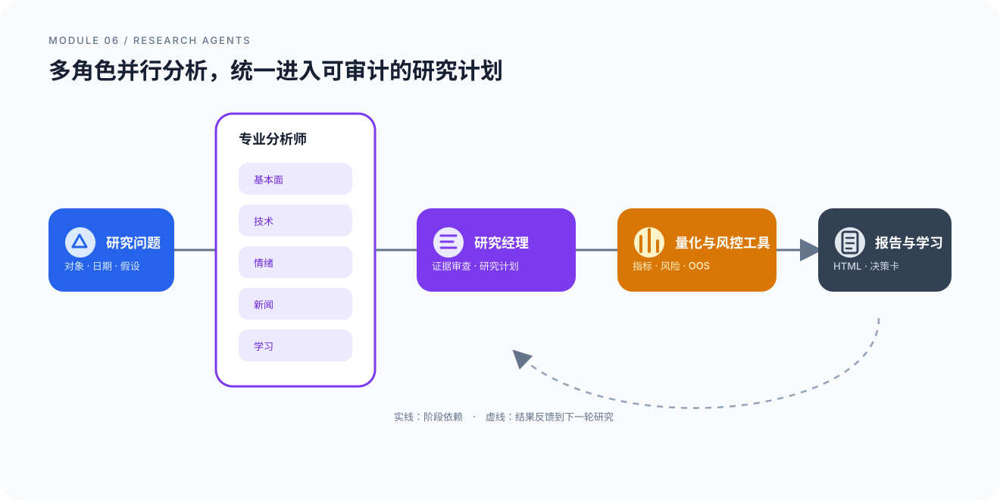
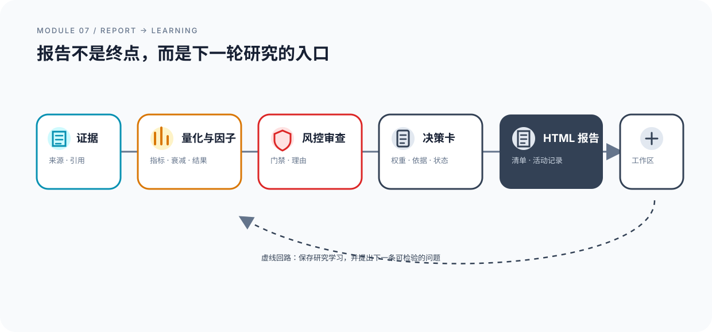

# Finathink

## 本地优先的金融研究与量化策略工作台

Finathink 把金融事件、证据、知识、统计分析、因子研究、策略回放、风险检查和学习记录组织成一条可追溯的研究链路。用户可以从一个事件或一个问题开始，逐步得到结构化分析、量化结果、因子证据、策略决策卡和可离线阅读的 HTML 研究报告。

Finathink 适合个人研究、量化学习、策略复盘和多代理协作。核心运行在本地，研究数据、计算过程、模型选择、风险检查和输出报告都可以在同一条链路中查看。

## 一条完整的研究闭环

```text
金融事件
  ↓
证据与来源
  ↓
知识理解（直觉 → 定义 → 方程 → 推导 → 代码 → 金融含义）
  ↓
量化问题与数据检查
  ↓
因子生成、检验、衰减评估与准入
  ↓
信号 → 仓位 → 风控 → 延迟执行 → 成本与滑点
  ↓
研究决策卡与 HTML 报告
  ↓
学习记录、个人工作区与下一轮研究问题
```



## Finathink 研究架构图



这张总图把每个模块的职责、颜色和工件串起来：蓝色是事件，青色是证据，紫色是知识，绿色是数据，金色是量化，橙色是因子，红色是风控，深灰色是报告与学习。

<details>
<summary>展开查看模块小流程图</summary>

<table>
  <tr>
    <td></td>
    <td></td>
  </tr>
  <tr>
    <td></td>
    <td></td>
  </tr>
  <tr>
    <td></td>
    <td></td>
  </tr>
  <tr>
    <td colspan="2"></td>
  </tr>
</table>

</details>

## Finathink 可以做什么

### 1. 从金融事件开始学习和研究

- 保存经过整理的金融事件、来源、原始载荷、采集时间和数据指纹。
- 查看事件中的事实、主张、证据引用和来源链路。
- 从事件直接跳转到相关知识、量化问题和策略研究。
- 将事件理解、公式推导、代码解释、金融含义和策略应用串成学习路径。
- 把研究结论保存到个人工作区，重新打开时继续研究。

### 2. 结构化知识引擎

Finathink 的知识页面按渐进深度组织内容：

```text
直觉 → 定义 → 方程 → 推导 → 证明/假设 → 代码 → 金融/量化/策略应用 → 当前语境
```

知识单元可以与事件、图表、因子、策略和研究报告互相引用。页面提供可读的公式、代码轨迹、前置知识、应用场景和结构化 JSON 接口，便于继续学习或接入自己的研究流程。

### 3. 有界量化实验

用户可以用一个明确的问题和假设启动量化实验。系统会把以下信息一起保存：

- 数据集、样本数量、观察区间和时间口径；
- 统计方法、估计值、标准误和置信区间；
- 研究运行 ID、数据指纹、来源链路和结果摘要；
- 结果解释、后续问题和学习记录。

量化实验可从 Quant 页面或 API 启动，适合检验收益、波动率、Beta、Sharpe、回撤以及其他可复现的研究问题。

### 4. Strategy Lab：从想法到策略回放

Strategy Lab 将一个策略想法整理为可检查的 `StrategySpec`，并沿着下面的步骤展开：

```text
策略想法 → 特征图 → 数学与代码 → 回测 → OOS 检验 → 纸面组合 → 结果比较 → 学习记录
```

每个步骤都保留输入、参数、数据指纹、结果和解释。用户可以比较不同参数、查看样本内外结果、检查策略稳定性，并将研究过程保存为可再次打开的工作节点。

### 5. Factor Strategy Workbench：因子到策略的完整链路

Factor Strategy Workbench 将因子研究拆成六个可观察层：

1. **数据层**：带有时间点口径、数据指纹和来源可用性的信息快照。
2. **因子层**：使用受控 DSL 描述因子表达式，支持 `return`、`lag`、`rolling_mean`、`rolling_std`、`zscore`、`rank`、`winsorize`、`combine`、`negate` 等基础算子。
3. **信号层**：记录因子分数、资格条件和点时可用性。
4. **仓位与风控层**：处理权重映射、仓位上限、现金缓冲、换手与流动性约束、风险状态、滞回和风险动作。
5. **执行层**：记录延迟持仓、成交、费用、滑点、被阻断的交易和故障事件。
6. **解释层**：同时给出概念、直觉、公式、推导、代码轨迹、金融含义、参数影响、结果字段、假设和下一步实验。

因子研究台还会维护因子台账，逐轮记录：

- 候选表达式与研究假设；
- 字段依赖、样本覆盖和数据质量；
- IC、ICIR、分位数组合、多空结果；
- 换手、成本、多周期衰减；
- 训练/验证/测试划分、冻结记录和准入理由；
- 证据引用、策略标识和可重放的研究指纹。

打开 `/workbench` 即可查看数据、因子、信号、仓位、风控、交易、成本、报告引用和历史研究记录。

### 6. 多代理研究框架

Finathink 提供面向金融研究的角色化代理框架。一个研究任务可以由多个专业角色共同完成：

- 基本面分析师；
- 技术分析师；
- 情绪分析师；
- 新闻分析师；
- 学习分析师；
- 研究经理；
- 量化研究与交易角色；
- 风险管理、投资组合和学习经理角色。

研究编排器把角色输出汇总为结构化研究计划，再依次执行数据检查、证据审查、量化验证、风险审查、纸面决策、HTML 报告和学习记录。每一轮都有明确的角色、状态、证据引用、模型标识和运行事件，便于复盘和追踪。

### 7. 接入用户自己的模型 API

用户可以把自己的模型 provider 和模型配置接入研究流程，并为不同角色设置不同的模型：

- 支持默认 provider、角色模型映射和单次运行选择；
- 支持离线模型、Codex handoff 和用户自有兼容 API 驱动；
- 通过环境变量或钥匙串引用管理用户的 API 配置；
- 在 `/settings/providers` 查看 provider、模型、能力和连接状态；
- 通过 `GET /api/research/providers` 获取结构化 provider 状态；
- 在研究报告中记录本轮使用的 provider、模型和角色映射。

配置示例位于 [`docs/research-providers.example.json`](docs/research-providers.example.json)。研究角色、数据工具、因子引擎和报告生成器通过 typed contract 协作，便于替换模型和扩展 provider。

### 8. 数据接入与数据质量检查

Finathink 通过数据源适配器统一数据结构，并在研究链路中保留：

- 数据源名称、来源说明和时间口径；
- point-in-time/as-of 信息；
- 数据快照指纹和字段依赖；
- 数据可用性、覆盖范围和质量结果；
- 事件、行情、因子和策略之间的引用关系。

样例数据可以直接启动研究流程；用户也可以按照数据适配器契约接入自己的数据源，并在 `/settings/data-sources` 查看数据源状态。

### 9. 离线 HTML 研究报告

每次研究都可以生成自包含的 HTML 报告，适合保存、分享和归档。报告包括：

- 研究问题、研究计划和运行摘要；
- 分析师结果与证据引用；
- 因子候选、量化指标、衰减和准入证据；
- 信号、仓位、风控、交易、费用和滑点；
- provider/model 状态和研究配置；
- 决策卡、报告清单、数据指纹和学习记录。

报告内置样式和图表资源，可以作为独立研究成果打开，不依赖正在运行的服务器。报告生成器同时写出结构化清单和活动记录，方便后续审计、重放和二次分析。

### 10. 统一的研究界面

本地应用提供以下入口：

| 页面 | 用途 |
| --- | --- |
| `/` | 研究首页与产品导航 |
| `/events` | 金融事件、证据和来源链路 |
| `/explore` | 从自然语言问题进入知识与研究路径 |
| `/knowledge` | 结构化知识目录与学习路径 |
| `/quant` | 有界量化实验 |
| `/strategy` | Strategy Lab 策略回放 |
| `/research` | 研究工作区、图表和观测数据 |
| `/workbench` | 因子策略工作台 |
| `/ml` | 研究模型与实验观察 |
| `/parameter` | 参数实验、OOS 对比和稳定性观察 |
| `/workspace` | 个人研究、学习记录和导出 |
| `/settings/providers` | 模型 provider 和角色映射 |
| `/settings/data-sources` | 数据源状态与适配器信息 |
| `/settings/engines` | 研究引擎能力 |
| `/diagnostics` | 本地运行状态与诊断信息 |

## 快速开始

要求 Python 3.11 或更高版本。

```bash
python3 -m venv .venv
source .venv/bin/activate       # Windows PowerShell: .venv\\Scripts\\Activate.ps1
python3 -m pip install --upgrade pip
python3 -m pip install -e '.[dev]'
python3 -m pytest -q
python3 scripts/run_local_app.py --sample --port 8765
```

打开以下地址开始使用：

- 首页：<http://127.0.0.1:8765/>
- 研究工作区：<http://127.0.0.1:8765/research>
- 因子策略工作台：<http://127.0.0.1:8765/workbench>
- Provider 设置：<http://127.0.0.1:8765/settings/providers>

推荐的第一条路径是：

```text
捕获的 CPI 事件 → 证据与主张 → Inflation 知识单元
→ 方程与推导 → 量化实验 → 学习记录 → Workspace
```

## 前端开发

研究界面使用仓库内的前端源代码和锁定依赖：

```bash
cd frontend
npm install
npm test
npm run build
```

构建结果会写入 `site/assets/`，由本地应用直接提供。

## 仓库结构

```text
src/finahinking/        Python 核心包、研究编排、量化与报告引擎
frontend/               研究图表、工作台和交互界面
fixtures/               可复现的样例与测试数据
tests/                  单元、集成、契约和产品流程测试
migrations/             SQLite/PostgreSQL 兼容的增量数据库结构
docs/                   架构、研究指南、数据适配器与验证文档
site/                   静态产品入口与前端构建资源
.github/                CI、发布和安全自动化配置
```

## 研究文档

- [快速开始](docs/QUICKSTART.md)
- [安装说明](docs/INSTALLATION.md)
- [流程图与视觉规范](docs/FINATHINK_DIAGRAM_SYSTEM.md)
- [Factor Strategy Workbench 指南](docs/FACTOR_STRATEGY_WORKBENCH_GUIDE.md)
- [Factor Strategy Workbench 验证记录](docs/FACTOR_STRATEGY_WORKBENCH_VALIDATION.md)
- [研究代理指南](docs/RESEARCH_AGENT_GUIDE.md)
- [策略研究指南](docs/STRATEGY_RESEARCH_GUIDE.md)
- [数据适配器贡献指南](docs/DATA_ADAPTER_CONTRIBUTION.md)
- [知识贡献指南](docs/KNOWLEDGE_CONTRIBUTION.md)
- [GitHub 研究参考目录](docs/GITHUB_REFERENCE_CATALOG.md)
- [自主执行报告](docs/FINATHINK_AUTONOMOUS_EXECUTION_REPORT.md)
- [自主验证记录](docs/FINATHINK_AUTONOMOUS_VALIDATION.md)

## 开发与贡献

提交代码或文档前，可以运行完整的本地质量检查：

```bash
python3 scripts/validate_governance.py .
python3 -m pytest -q
python3 -m ruff check src tests scripts
python3 -m pip check
git diff --check
```

贡献方式、知识单元、数据适配器和功能契约分别见 [`CONTRIBUTING.md`](CONTRIBUTING.md)、[`docs/KNOWLEDGE_CONTRIBUTION.md`](docs/KNOWLEDGE_CONTRIBUTION.md)、[`docs/DATA_ADAPTER_CONTRIBUTION.md`](docs/DATA_ADAPTER_CONTRIBUTION.md) 和 [`docs/FEATURE_CONTRIBUTION.md`](docs/FEATURE_CONTRIBUTION.md)。

## 许可证

代码和文档采用 [MIT License](LICENSE)。第三方声明、数据来源和样例数据说明分别记录在 [`docs/p8/P8_LICENSE_REVIEW.md`](docs/p8/P8_LICENSE_REVIEW.md) 和 [`docs/DATA_SOURCES.md`](docs/DATA_SOURCES.md)。
