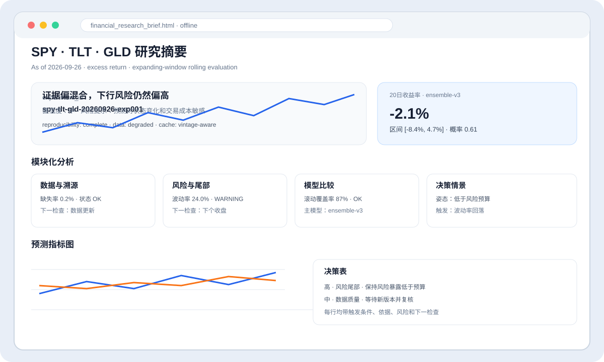
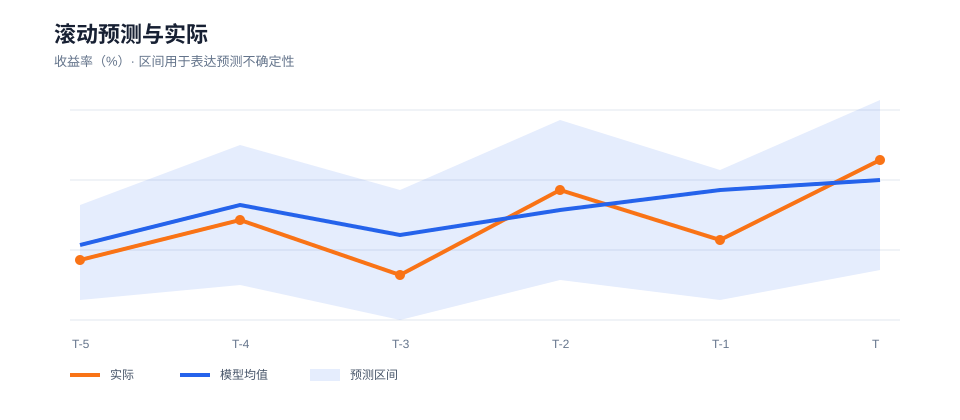
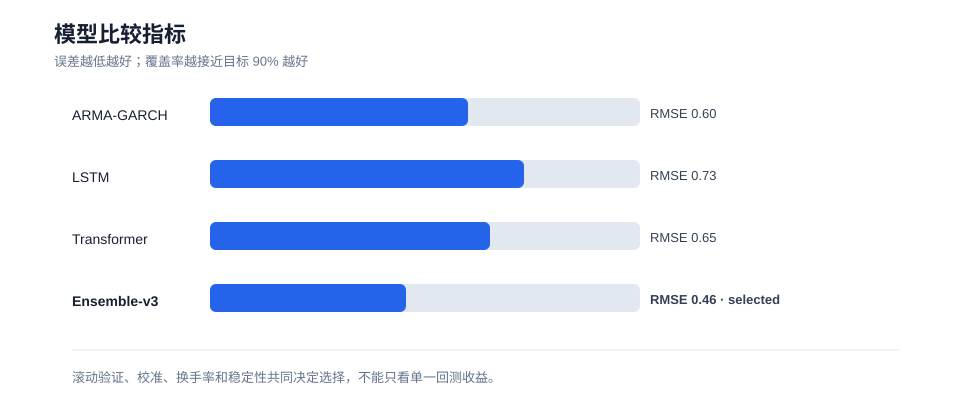
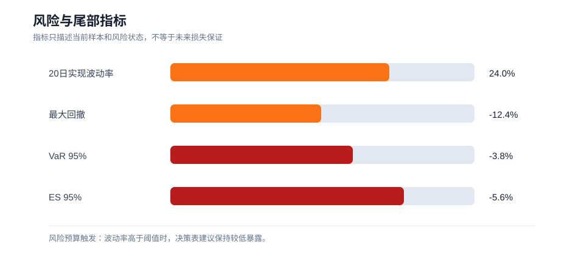
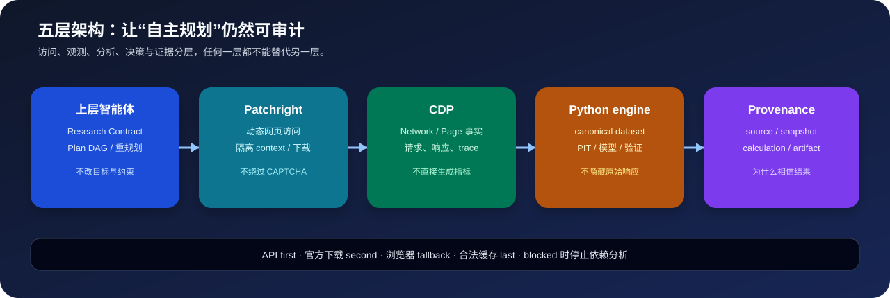
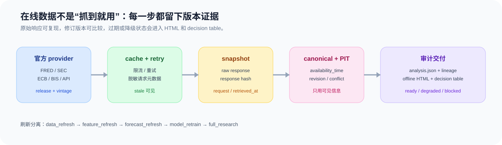
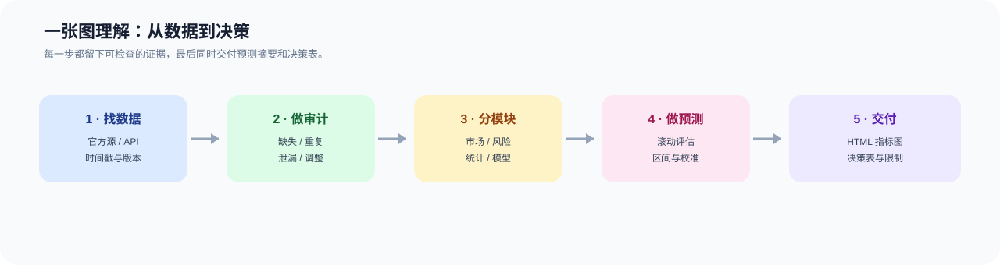
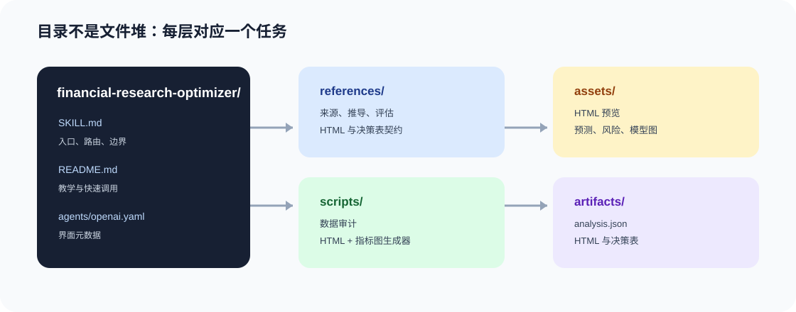
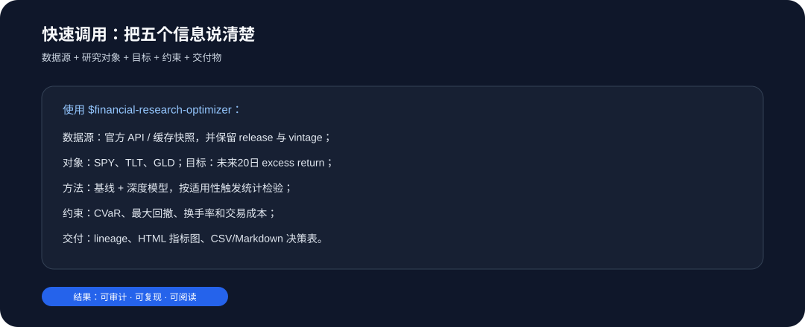

# Financial Research Optimizer

一个由上层智能体驱动、可审计的 Python 金融研究执行引擎。它把 Patchright 浏览器访问、CDP 事实观测、Python 标准化/分析、Plan DAG 规划和 provenance 证据链组合起来；读取金融数据后，按模块分析、形成条件预测，并强制生成精炼的离线 HTML 摘要和决策表。

它按 `minimal`、`standard`、`research_grade`、`portfolio_grade` 四个输出等级运行；每次运行先通过 `run_preflight.py`，再进入数据、模型、回测和组合阶段。

当前稳定版本：[`v1.2.0 — Interactive Explainable Dashboard`](https://github.com/ceyyy427/financial-research-optimizer/releases/tag/v1.2.0)。

### v1.2.0 更新摘要

- 离线 Dashboard 增加 Overview、Why this forecast、Forecast、Risk、Portfolio、Provenance 和 Learning mode；支持标签页、模型/来源/时间范围筛选、表格排序、图表 hover、折叠解释卡和深色/浅色主题。
- 新增统一 UI state schema；浏览器交互只改变展示，不重新计算预测、风险、权重或 RMSE，所有需要改变结果的情景操作回到 Python Runtime。
- 解释层输出 `knowledge_explanations.json` 和 `formula_manifest.json`，每条结论绑定 evidence、calculation、formula、confidence、caveats 和 next check。
- 新增 TeX→PDF→SVG 的可选公式构建链；缺少编译器或转换器时明确返回 `FORMULA_COMPILE_FAILED`/`FORMULA_RENDER_FAILED`，不伪装成已编译资产。
- MCP 新增 `preview_scenario`、`compare_models`、`explain_metric`、`get_formula`、`get_provenance`、`refresh_source` 和 `get_plan_progress`。

### v1.1.0 更新摘要

- 组合层从 baseline 升级为真实约束求解，并分别比较四类协方差模型；不可行问题明确 fallback。
- DM、WRC、SPA、DSR、PBO 与 block bootstrap 按适用性实际执行，pending/failed 不会伪装成成功。
- 压力测试重新计算收益、风险、成本、换手、权重变化和约束状态；新增稳定 Python API、Dashboard 和 Explainable Research 层。

### v1.0.0 更新摘要

- 冻结 SourceRequest、SourceResult、RunStatus、ForecastResult、MCP response 和 artifact manifest 的 v1 协议；SQLite WAL 为多客户端默认状态层。
- 五种研究模式和 release gate 具备明确的 completed、degraded、blocked 语义，未实现节点不能伪装成功。
- 每次完成运行生成可复现的 HTML、decision table、lineage、provenance 和实验清单。
## 安装与最小运行

以下步骤适用于 macOS、Linux 和已安装 Python 3.11+ 的 Windows 环境。项目要求
Python 3.11 或更高版本；建议始终使用虚拟环境，避免污染系统 Python。

### 1. 从 GitHub 安装源码版

```bash
git clone https://github.com/ceyyy427/financial-research-optimizer.git
cd financial-research-optimizer
python3 --version                 # 应为 3.11 或更高
python3 -m venv .venv
source .venv/bin/activate         # Windows PowerShell: .venv\Scripts\Activate.ps1
python3 -m pip install --upgrade pip
python3 -m pip install -e .
```

`-e` 表示 editable install：修改源码后无需重新安装。核心依赖由 `pyproject.toml`
中的 `numpy`、`pandas` 和 `PyYAML` 提供。

### 2. 安装可选能力

```bash
python3 -m pip install -e '.[test]'       # pytest、jsonschema
python3 -m pip install -e '.[mcp]'        # MCP 服务
python3 -m pip install -e '.[browser]'    # Patchright 浏览器适配器
python3 -m pip install -e '.[pdf]'        # PDF 表格抽取
python3 -m pip install -e '.[test,browser,mcp,pdf]'  # 全部可选能力
```

浏览器和在线数据能力不会绕过登录、验证码、付费墙或访问控制；缺少授权时会返回
`blocked` 或 `manual_review_only`。

安装测试依赖后，先运行本地质量检查：

```bash
python3 -m pip install -e '.[test]'
python3 -m pytest -q
python3 scripts/validate_schemas.py
python3 scripts/validate_source_registry.py --registry config/source_registry.yaml
```

安装完成后可确认客户端入口：

```bash
fro-preflight --help
fro-forecast --help
fro-release-gate --help
fro-run-store --help
```

### 3. 最小离线运行

下面的命令不访问网络，使用仓库内 synthetic 示例完成 preflight、HTML 和 decision
table 生成：

```bash
mkdir -p artifacts
python3 scripts/run_preflight.py \
  --config examples/research_config.json \
  --manifest examples/experiment_manifest.json \
  --analysis examples/demo_analysis.json \
  --output artifacts/preflight.json
python3 scripts/generate_financial_html.py examples/demo_analysis.json \
  --config examples/research_config.json \
  --manifest examples/experiment_manifest.json \
  --output-dir artifacts \
  --decision-format both
```

`artifacts/financial_research_brief.html` 是离线 HTML 报告，CSV 和 Markdown decision
table 位于同一目录。`blocked` 表示前置条件未满足，不能把该次运行当成完成的研究。

### 4. 本地 forecasting 与状态层

实际 forecasting 使用 CSV/JSON 数据时，在研究配置中提供 `dataset_path`；至少需要
`timestamp` 和一个数值列，推荐同时提供 `instrument_id`、`availability_time`、
`source_id` 和 `unit`，以便 PIT 审计和 lineage 正常工作。默认比较 historical mean、
naive persistence 和 rolling mean，并输出滚动评估、残差区间、校准状态、OOD 状态、
HTML 和 decision table。样本不足或 PIT/schema 审计失败时会返回 reason code，而不会
生成伪造预测。

v1.0 默认使用 SQLite WAL，适合 MCP 和多客户端；JSON 只作为显式离线兼容模式：

```bash
python3 -m financial_research.run_store_cli migrate --root artifacts/runs
python3 -m financial_research.run_store_cli doctor --root artifacts/runs
FRO_RUN_STORE=json fro-preflight --help  # 需要 JSON 兼容后端时设置
```

### 5. 最小 MCP 启动

安装 MCP extra 后，可用 stdio 启动本地 MCP，或启动受保护的本地 HTTP 服务：

```bash
python3 -m pip install -e '.[mcp]'
fro-mcp
fro-mcp --transport streamable-http --host 127.0.0.1 --port 8000
```

详细配置见 `references/mcp_interface.md`；MCP 只调用统一 runtime，不替代数据审计、
来源成熟度和 provenance 规则。

### 6. 常见安装问题

- `python3: command not found`：安装 Python 3.11+ 后重新创建 `.venv`。
- `ModuleNotFoundError: jsonschema`：执行 `python3 -m pip install -e '.[test]'`。
- `fro-*` 找不到：确认虚拟环境已激活，并重新执行 `python3 -m pip install -e .`。
- `preflight` 返回 `blocked`：查看 `reason_code`、`next_action` 和
  `user_action_required`，不要修改结果 JSON 绕过门禁。

## 适用场景

- 搜索公开股票、指数、基金、期货、利率、汇率、商品或宏观数据；
- 分析市场状态、资讯主题、波动率和风险暴露；
- 比较 OLS、岭回归、ARMA/GARCH、LSTM、CNN、Transformer、贝叶斯模型和图模型；
- 进行滚动预测、概率校准、压力测试和多轮模型比较；
- 在交易成本、换手率、流动性、杠杆和风险预算约束下做组合优化。
- 当数据位于关系数据库时，通过 Java/MyBatis 做只读、按时间窗口、可溯源的数据读取，再交给统计和深度学习模型。
- 数据审计按观测粒度检查 instrument × timestamp × field × vintage，输出 completeness、freshness、point-in-time、source reliability 和 `usable/usable_with_warning/degraded/blocked` 决策；schema drift 会单独阻断依赖分析。
- 将数据质量、市场状态、统计结构、风险尾部、预测比较和决策情景分模块呈现；每个模块同时给出事实、解释、预测、置信度和下一次检查项。
- 生成单文件、无外部依赖的 HTML 可视化摘要，以及 CSV/Markdown 决策表。
- 对多模型回测执行 DM、White Reality Check、SPA、DSR 和 PBO 审计；对样本、Ledoit-Wolf、因子和稳健协方差进行扰动比较，并记录可复现实验 Manifest。
- 对尾部风险输出 VaR、CVaR/ES、尾部条件方差、超过 VaR 的样本数和 moving-block Bootstrap 区间；按分布注册表区分 empirical、Gaussian 与尚未启用的 Student-t、广义 Laplace、混合椭球 challenger。
- 对组合资产集合可运行有效资产子集检验，按预先声明的基准集合、候选集合、块长度、重复次数和滚动窗口判断候选资产是否提供不可替代的均值—方差机会集信息。
- 在 (p \gg n) 场景提供训练窗口内 Fisher 因子筛选 challenger；筛选范围、类别样本数和稳定性必须写入 lineage，不能把全样本筛选结果带入样本外窗口。
- 通过 FRED/ALFRED、SEC EDGAR、ECB SDMX、BIS SDMX 适配器保存原始响应、缓存、哈希和 revision/vintage 信息；API 优先，浏览器是受控 fallback。
- 通过 Plan DAG 让上层智能体选择下一步、有限重试和声明式降级，但不得修改研究目标、放宽约束或执行交易。
- 回测必须显式声明 signal/decision/execution 时间、市场日历、延迟、滑点和部分成交规则；同日 close 信号同日 close 成交会被 preflight 阻断。

## 输出理念

Skill 把结果拆成四层：

1. 数据事实：来源、时间、字段和质量；
2. 统计/深度模型：条件分布、预测和不确定性；
3. 决策层：组合目标、约束、成本和优化结果；
4. 审计层：滚动验证、稳定性、压力测试和失败边界。

每次运行还必须登记 `experiment_id`、数据快照哈希、代码/环境版本、随机种子、模型参数、特征版本、训练/评估窗口和输出文件。多源数据先经过 `source_reconciliation`；如果出现未解决的实质冲突，HTML 和决策表必须显示阻断状态，不能继续给出依赖该数据的结论。

“最佳模型”只表示在预先声明的样本外指标和风险约束下表现最好的候选，不表示保证未来收益。Skill 不会自动下单。

## 可视化预览

生成的 HTML 是一个精炼的研究摘要：顶部给出结论、预测值、区间和置信度；中部按模块呈现数据、风险与模型证据；底部给出决策表和复现信息。



HTML 会把预测后的指标直接绘制成内嵌 SVG 图，包括实际值与模型均值、预测区间、风险指标和模型比较结果。这样打开单个 HTML 文件即可查看，不依赖 CDN 或外部前端服务。

### 交互式可解释 Dashboard

当前 HTML 仍是单文件离线产物，但增加了本地交互层：Overview、Why this forecast、Forecast、Risk、Portfolio、Provenance 和 Learning mode 标签页；模型/来源/时间范围筛选；表格排序；图表 hover/focus；主题切换；公式、证据、lineage 和限制的折叠查看。上述操作只改变已保存 artifact 的展示，不在浏览器端重新计算金融结果。

需要改变预测、风险或组合结果时，通过 MCP/Python Runtime 调用 `preview_scenario`、`compare_models`、`explain_metric`、`get_formula`、`get_provenance`、`refresh_source` 或 `get_plan_progress`。情景操作会生成新的 `scenario_id`、结果 hash、lineage 和报告，不覆盖原始研究结果。公式可通过以下命令构建：

```bash
fro-formula-build --input artifacts/run_001/knowledge_explanations.json --output artifacts/run_001/formulas
```

如果本机没有 Tectonic/XeLaTeX 或 PDF→SVG 转换器，命令会返回 `FORMULA_COMPILE_FAILED` 或 `FORMULA_RENDER_FAILED`，并保留 TeX 源码和 blocked manifest，不把未编译公式伪装成图片。







## 分层流程

agent contract -> plan DAG -> preflight -> source routing + health -> API/cache/browser/CDP capture -> raw snapshot -> canonical transformation -> grain/quality/schema-drift audit -> reconciliation -> point-in-time audit -> feature/label contract -> baselines -> challengers -> rolling validation -> applicable diagnostics -> calibration/OOD -> tail-risk distribution audit -> covariance robustness/fragility -> effective subset test -> portfolio optimization -> monitoring -> selection -> provenance manifest -> HTML + decision table

每个阶段都要保存可检查的中间结果，避免只输出一个无法追溯的预测数字。任何完成的数据分析都必须至少产出：`analysis.json`、精炼 HTML、决策表和数据/模型审计记录。

可执行模式：

| 模式 | 最低交付物 |
|---|---|
| `data_audit` | 数据字典、质量报告、来源清单 |
| `descriptive_analysis` | 市场状态、风险指标、图表 |
| `forecasting` | 基线、滚动预测、区间、校准 |
| `backtest` | 成本、换手、风险、适用的过拟合诊断 |
| `portfolio_research` | 权重、约束、协方差稳健性、压力测试和归因 |

只有 `backtest` 和 `portfolio_research` 强制进入完整适用性审计；`not_applicable` 不被当作失败。

## 五层执行架构

| 层 | 职责 | 不负责的事情 |
|---|---|---|
| 上层智能体 | 解析任务、生成 Research Contract、选择 Plan DAG 节点和声明式 fallback | 不直接操作浏览器对象，不改目标/成本/风险约束 |
| Patchright | 动态网页、隔离 context、授权态、下载、截图和 trace | 不做模型计算、数据可信判断、交易或访问控制绕过 |
| CDP | Network/Page/Runtime/Target/Storage/Fetch/Performance/Tracing 的事实观测 | 不把页面显示值直接变成 canonical 数据 |
| Python engine | API/cache/snapshot、标准化、PIT 审计、特征、模型、验证和输出 | 不隐藏原始响应或跳过 provenance |
| Provenance | source/snapshot/calculation/input/code/artifact 的可追溯证据链 | 不替模型或智能体做未声明的决策 |



这五层分别回答“下一步做什么”“如何访问网页”“浏览器实际发生了什么”“如何标准化、分析和验证”以及“为什么相信这个结果”。

结果 lineage 是 HTML 门禁：任何进入图表、审计区块或决策产物的数值都必须拥有 `source_ids`、`calculation_id`、`input_hash`、`code_version` 和 `formula`。运行：

```bash
python3 scripts/verify_result_lineage.py examples/demo_analysis.json
python3 scripts/schema_drift.py tests/fixtures/synthetic_financial.csv tests/fixtures/synthetic_financial.csv --output artifacts/schema_drift.json
python3 scripts/validate_financial_dataset.py tests/fixtures/synthetic_financial.csv --config examples/research_config.json --output artifacts/data_quality.json
```

## 在线数据与降级

在线连接器位于 `scripts/online/`：

- `fred_alfred.py`：series、release 和 real-time/vintage 参数；
- `sec_edgar.py`：submissions 与 XBRL Company Facts；
- `ecb_sdmx.py`、`bis_sdmx.py`：SDMX flow/key 查询；
- `http_cache.py`、`retry_policy.py`、`snapshot_store.py`：缓存、重试、原始响应和快照 Manifest；
- `provider_registry.py`：API → 官方下载/浏览器 → 合法缓存的路由策略。



刷新被拆为 `data_refresh`、`feature_refresh`、`forecast_refresh`、`model_retrain` 和 `full_research`。新数据不会自动触发重训；只有预定周期或漂移阈值满足时才进入重训流程：

```bash
python3 scripts/build_refresh_plan.py --config examples/research_config.json --output artifacts/refresh_plan.json
# compatibility alias: python3 scripts/run_online_refresh.py ...
python3 scripts/execute_online_refresh.py \
  --source-id sec_edgar \
  --url https://data.sec.gov \
  --params '{"cik":"320193","endpoint":"companyfacts"}' \
  --user-agent 'research@example.com' \
  --output-dir artifacts/online

# Tonghuashun public daily-line snapshot through the browser adapter
python3 -m pip install -e '.[browser]'
python3 -m patchright install chromium
python3 scripts/execute_online_refresh.py \
  --source-id 10jqka \
  --url https://d.10jqka.com.cn/v4/line/hs_000001/01/last.js \
  --params '{"instrument_id":"000001","market":"SZ"}' \
  --output-dir artifacts/online-10jqka
python3 scripts/check_data_freshness.py artifacts/snapshots/provider/snapshot.json --output artifacts/freshness.json
python3 scripts/monitoring/model_monitor.py artifacts/monitor_input.json --output artifacts/monitoring_status.json
```

`execute_online_refresh.py` only acquires and snapshots data. It does not
retrain models, refresh features, or produce a forecast implicitly. Planned
adapters and `partial` adapters are rejected for automatic primary use; pass
`--allow-degraded` only when a manual-review checkpoint is intended. Provider
construction is source-specific: FRED/ALFRED inject API/vintage parameters,
SEC enforces a contact-bearing User-Agent, and ECB/BIS use SDMX flow/key
parameters. A generic provider is never silently substituted.

Maturity is evidence-driven and evaluated at `source_id + dataset_id + access_method`, not copied directly from YAML:

| 状态 | 含义 |
|---|---|
| `automatic_execution_ready` | L3：factory、契约、fixture、集成和质量证据齐全，可执行但不代表在线认证 |
| `live_certified` | L4：在线 smoke、健康、新鲜度、PIT、快照哈希和最近成功证据齐全 |
| `degraded_execution_ready` | 有真实可执行 fallback；没有 fallback 的 partial 不计入此类 |
| `manual_review_only` | 已声明 partial，但进入 `ContractOnlyAdapter`，只能人工复核 |
| `contract_only` / `blocked` | 只有契约或 planned，禁止获取和依赖分析 |

权威主路由还要求 `authority_primary_allowed=true`；同花顺、东方财富、Yahoo 等二级来源默认 `cross_check_only=true`。FRED/ALFRED 的 API 授权和 ALFRED vintage 参数仍是运行时门禁。路由评分还会读取 source health、最近成功/失败时间和延迟；`stale/degraded` 只能以显式状态进入结果。

运行 `python3 scripts/adapters/status.py` 可查看
`automatic_execution_count`、`live_certified_count`、`degraded_execution_count`、
`manual_review_only_count`、`authority_primary_count` 和 `cross_check_only_count`。

离线回放 smoke（不访问网络）和在线 smoke 入口：

```bash
python3 scripts/run_adapter_smoke.py \
  --source-id stats_gov_cn --dataset macro_series --mode replay \
  --fixture tests/fixtures/http/stats_gov.json --instrument CPI \
  --output artifacts/smoke/stats_gov_cn.json
python3 scripts/run_adapter_smoke.py \
  --source-id sec_edgar --dataset company_facts --mode live \
  --url https://data.sec.gov/api/xbrl/companyfacts/CIK0000320193.json \
  --params '{"cik":"0000320193"}' --output artifacts/smoke/sec_edgar.json
```

smoke 结果只作为证据写入输出，不会自动把来源提升为 `live_certified`；提升需要显式更新证据、健康、新鲜度和认证信息。

动态 preflight 状态为 `ready`、`stale`、`degraded`、`fallback` 或 `blocked`。只有 `blocked` 禁止继续依赖分析；其余状态必须在 HTML 中显示数据延迟、缓存、模型和预测有效期。

## 金融网站 Source Adapter Registry

`config/source_registry.yaml` 把国家数据、人民银行、巨潮、上交所、深交所、东方财富、同花顺、Wind、CSMAR、SEC EDGAR、FRED/ALFRED、Nasdaq Data Link、Yahoo Finance、Investing.com、TradingView、AkShare、Tushare 和 JoinQuant 定义成可路由的 source profile。上层智能体按权威性、Point-in-Time 能力、字段完整度、新鲜度、授权状态和稳定性选择来源，而不是只判断网页能否打开：

```bash
python3 scripts/validate_source_registry.py
python3 scripts/adapters/status.py
python3 scripts/source_router.py \
  --topic "美国 CPI 历史修订值" \
  --universe CPIAUCSL \
  --capability point_in_time \
  --capability vintage_data
```

Adapter maturity is recorded in `config/adapter_evidence.json` and evaluated
by `scripts/adapters/evidence.py`; `implementation_status` and `parser_status`
are only declarations. See [`references/adapter_maturity.md`](references/adapter_maturity.md). The
Patchright/CDP lifecycle, body capture boundary, and authentication checkpoint
are specified in [`references/cdp_capability_contract.md`](references/cdp_capability_contract.md).

适配链路固定为：`官方 API → 官方下载 → 已授权数据库 → Patchright → CDP → DOM → 合法缓存`。原始响应先通过 `scripts/source_snapshot.py` 保存哈希和请求元数据，再由 `scripts/normalize_observations.py` 转成 `schemas/canonical_observation.schema.json`；未经 canonicalization 的记录不能进入模型。Wind、CSMAR、Nasdaq Data Link 和 JoinQuant 只接受授权 API、数据库、CSV/Excel 或快照导入，不进行未授权爬取。

## 标准呈现

默认按以下结构输出：

- 研究合同；
- 数据来源与质量审计；
- 内容/市场状态摘要；
- 特征和标签公式；
- 模型卡和假设；
- 滚动预测与校准；
- 组合目标与约束；
- 多轮比较和选择规则；
- 情景分析；
- 局限性与复现信息。



阅读顺序是：先确认数据事实，再看统计与深度模型，最后阅读情景预测和决策表。图表只展示已有的计算结果，不替代滚动评估、数学推导或数据溯源。

## HTML 与决策表

结构化分析完成后先运行 preflight，再生成 HTML：

```bash
python3 scripts/run_preflight.py \
  --config examples/research_config.json \
  --manifest examples/experiment_manifest.json \
  --analysis examples/demo_analysis.json \
  --output artifacts/preflight.json
python3 scripts/generate_financial_html.py examples/demo_analysis.json \
  --config examples/research_config.json \
  --manifest examples/experiment_manifest.json \
  --output-dir artifacts --decision-format both
```

HTML 默认包含：标题与 as-of 时间、核心结论、目标/概率/区间、模块状态卡、预测与风险指标图、模型卡、反过拟合审计、数据源冲突审计、尾部风险与分布敏感性、有效资产子集检验、组合稳健性、情景预测、风险提示和决策表。页首和决策层展示 `experiment_id` 与 `reproducibility_status`；它内嵌 CSS/SVG，可离线打开，不依赖 CDN，不展示没有来源或不确定性说明的数字；完成的预测运行不得省略指标图。

推荐显式绑定同一份研究配置和实验 Manifest：

```bash
python3 scripts/validate_research_config.py examples/research_config.json
python3 scripts/validate_experiment_manifest.py examples/experiment_manifest.json
python3 scripts/validate_schemas.py
python3 scripts/generate_financial_html.py examples/demo_analysis.json \
  --config examples/research_config.json \
  --manifest examples/experiment_manifest.json \
  --output-dir artifacts --decision-format both
```

可复算指标可以进一步执行声明的命令并校验输出文件哈希：

```bash
python3 scripts/verify_result_lineage.py analysis.json --recompute
```

示例文件：[`examples/financial_research_brief.html`](examples/financial_research_brief.html)。

决策表至少包含：优先级、模块、当前判断、建议动作/仓位姿态、触发条件、依据、风险、有效期、下一次检查、实验 ID、复现状态；在线运行还附带 `source_id`、访问方式、freshness、snapshot hash、revision、授权和 Point-in-Time 状态，以及数据/缓存/模型/预测状态。表中的“动作”是研究与决策支持表达，不是自动下单指令。

## 目录与职责



仓库按“智能体入口 → 运行时 → 脚本能力 → 契约与参考 → 示例与测试”组织。下面的路径与当前文件结构一致，新增文件应先归入已有职责目录。

```text
financial-research-optimizer/
├── SKILL.md                         # 智能体使用规则、阶段路由和停止条件
├── README.md                        # 面向使用者的安装、运行和输出说明
├── agents/openai.yaml               # Skill 的界面名称、简介和默认调用提示
├── financial_research/               # 统一 Python 运行时和 run store
│   ├── runtime.py                    # run_research() / run() 入口
│   ├── run_store.py                  # 默认 JSON 后端：锁、原子写入、租约、checkpoint
│   ├── store_protocol.py             # JSON/SQLite 后端共用协议
│   ├── json_run_store.py             # JSON 后端兼容别名
│   └── sqlite_run_store.py            # SQLite WAL 元数据后端
├── mcp_server/                       # MCP 薄适配层和生命周期工具
├── scripts/
│   ├── agent/                        # contract、Plan DAG、执行、预算、策略
│   ├── online/                       # FRED/ALFRED、SEC、ECB、BIS、缓存和快照
│   ├── adapters/                     # 金融网站和数据库 source adapter
│   ├── browser/                      # Patchright context、CDP、下载和 trace
│   ├── transform/、events/、parsers/ # 原始响应到事件/canonical 数据
│   ├── monitoring/                   # freshness、drift、calibration 和 fallback
│   ├── tail_risk.py                  # VaR/CVaR/尾部条件方差和 Bootstrap
│   ├── portfolio_subset_test.py      # 有效资产子集 screening test
│   ├── factor_selection.py           # 训练窗口内 Fisher 因子筛选
│   └── *.py                          # preflight、审计、验证、HTML 和组合脚本
├── references/                       # 按需读取的数学、数据和输出契约
├── agent_contracts/、schemas/         # 运行、MCP、来源和 canonical Schema
├── *.schema.json                     # 研究配置、分析、血缘、回测和组合 Schema
├── config/                           # source registry 和 adapter evidence
├── examples/                         # 可验证的输入、示例 HTML 和 decision table
├── tests/                            # synthetic 数据和回归测试
├── assets/                           # README/HTML 展示图
└── .github/workflows/                 # CI 和 package 发布流程
```

### 入口文件

| 任务 | 入口 | 结果 |
|---|---|---|
| 选择模式和输出等级 | `SKILL.md`、`references/preflight_contract.md` | 确定阶段、最低交付物和阻断规则 |
| 运行研究 | `financial_research/runtime.py` | 创建 contract、Plan DAG、checkpoint 和执行结果 |
| 读取/管理运行 | `financial_research/run_store.py`、`financial_research/store_protocol.py` | SQLite WAL 默认；`FRO_RUN_STORE=json` 保留离线兼容 |
| 接入 MCP | `mcp_server/server.py`、`references/mcp_interface.md` | create/status/read/cancel/resume/retry/list、source capability 与 `research://` |
| 获取与审计数据 | `scripts/source_router.py`、`scripts/online/`、`scripts/validate_financial_dataset.py` | source plan、快照、质量和 PIT 审计 |
| 生成交付物 | `scripts/verify_result_lineage.py`、`scripts/generate_financial_html.py` | 离线 HTML、CSV/Markdown decision table |
| 执行验证 | `scripts/validate_schemas.py`、`python3 -m pytest -q` | Schema、示例和测试结果 |

### 参考资料路由

| 研究阶段 | 首先阅读 |
|---|---|
| 研究模式、启动和停止 | `references/preflight_contract.md`、`references/workflow_blueprint.md` |
| 数据来源、修订和时间点 | `references/data_provenance.md`、`references/point_in_time_data.md`、`references/source_reconciliation.md` |
| 特征、标签和滚动评估 | `references/feature_label_contract.md`、`references/rolling_evaluation.md` |
| 模型假设和数学推导 | `references/model_derivations.md`、`references/model_selection_protocol.md` |
| 过拟合诊断 | `references/backtest_overfitting.md` |
| 组合和风险 | `references/portfolio_robustness.md`、`references/tail_risk.md`、`references/execution_contract.md` |
| 在线刷新和监控 | `references/online_data_contract.md`、`references/online_monitoring.md`、`references/adapter_maturity.md` |
| 浏览器访问和观测 | `references/patchright_cdp_contract.md`、`references/cdp_capability_contract.md`、`references/browser_security.md` |
| Java/MyBatis 数据层 | `references/java_data_layer.md`、`examples/java-mybatis/` |
| 输出、血缘和复现 | `references/content_contract.md`、`references/html_output_contract.md`、`references/result_lineage.md`、`references/experiment_manifest.md` |

### 产物边界

- `examples/` 是稳定的输入和展示样例，可纳入版本控制。
- `artifacts/` 是本地运行输出；`artifacts/runs/` 保存运行状态、事件和 checkpoint，不应提交到仓库。
- `tests/fixtures/` 是最小 synthetic financial dataset，测试不依赖在线数据。
- `assets/` 只放 README 或生成报告需要展示的静态资源。
- 新的研究契约先增加 Schema，再增加示例，再接入脚本和测试；不要把运行时状态写回 `examples/`。

### 关键契约与 Schema

根目录的 `*.schema.json` 保存研究配置、分析、结果血缘、在线快照、监控、回测过拟合和组合输出契约；`agent_contracts/` 保存 Plan DAG、节点、artifact 和 MCP 请求/状态契约；`schemas/` 保存 source profile、source snapshot、canonical observation 和 MCP envelope。校验统一使用：

```bash
python3 scripts/validate_research_config.py examples/research_config.json
python3 scripts/validate_experiment_manifest.py examples/experiment_manifest.json
python3 scripts/validate_schemas.py
```

## 快速调用

$financial-research-optimizer

示例：

使用 $financial-research-optimizer 搜索公开数据，比较 ARMA-GARCH、LSTM 和 Transformer 对沪深300未来20个交易日波动率的预测，在最大回撤、换手率和交易成本约束下进行多轮模型选择。



## Release 与 Python 包发布

仓库版本由 `pyproject.toml` 管理。发布 GitHub Release 后，
`.github/workflows/publish-package.yml` 会自动构建 wheel/sdist 并将它们附加到
Release。当前版本可从 [v1.2.0 Release](https://github.com/ceyyy427/financial-research-optimizer/releases/tag/v1.2.0)
下载：

```bash
python3 -m pip install https://github.com/ceyyy427/financial-research-optimizer/releases/download/v1.2.0/financial_research_optimizer-1.2.0-py3-none-any.whl
```

如需同步发布到 PyPI，在仓库 Settings → Secrets and variables → Actions 中增加
`PYPI_API_TOKEN`，后续 Release 会自动上传到 PyPI。未配置该 Secret 时，工作流会
明确跳过 PyPI 上传，但 GitHub Release 资产仍会正常发布。

GitHub 不提供 Python/PyPI Packages registry；为使仓库具备真正的 GitHub
Packages 产物，发布工作流同时构建并推送 GHCR 容器包：

```bash
docker pull ghcr.io/ceyyy427/financial-research-optimizer:v1.2.0
```

wheel/sdist 是 Python 分发包，位于 Release；GHCR 是可在 GitHub Packages
页面查看的容器分发包，两者用途不同。

快速调用时至少写清楚六件事：数据源、研究对象、预测目标、风险/成本约束、输出等级、交付物。Skill 会先执行 preflight，再生成模块总结、预测区间、指标图、HTML 和决策表。

### MCP 调用

MCP 只作为外部调用接口，不进入核心研究逻辑。安装可选依赖后，可用
stdio 供本地宿主启动，或用 Streamable HTTP 供受保护的服务端连接：

```bash
python3 -m pip install -e '.[mcp]'
fro-mcp
fro-mcp --transport streamable-http --host 127.0.0.1 --port 8000
```

所有生命周期工具都返回结构化状态；研究结果只能通过 `research://runs/...` 读取
已登记产物，不接受任意文件路径。默认 SQLite run store 使用 WAL、事务、busy
timeout、幂等键、租约/心跳、陈旧租约恢复和 checkpoint 指纹校验；设置
`FRO_RUN_STORE=json` 可切换到 JSON 离线兼容后端，设置
`FRO_MCP_RUN_ROOT` 可指定运行目录。MCP 适配层最终调用统一的
`financial_research.run_research`，所以 CLI、MCP 和未来 Web API 共用同一套
preflight、策略、数据血缘、checkpoint 和 HTML/decision table 规则。

上层 Python agent 也可使用统一接口；默认只生成计划并执行已注册 handler，不会直接启动浏览器或访问外网：

```python
import asyncio
from financial_research import run

result = asyncio.run(run(
    task="分析 SPY 未来 20 个交易日波动率",
    mode="forecasting",
    output_level="research_grade",
    universe=["SPY"],
    target="volatility",
    horizon="20d",
    constraints={"max_drawdown": 0.20, "transaction_cost_bps": 10},
))
```

浏览器访问必须显式安装 browser extra，并由 agent policy guard 检查 context 与权限；数据仍必须回到 Python canonicalization、PIT audit 和 provenance 流程。

## 免责声明

这是研究与决策支持工具，不是投资顾问、交易执行器或收益保证器。任何结论都必须结合数据更新时间、模型不确定性、市场制度变化和用户自己的风险承受能力。
